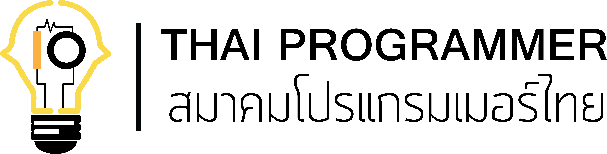

# Thai Programmer Association (TPA)

----

The [Thai Programmer Association (TPA)](https://www.thaiprogrammer.org) serves as a communal repository of information pertaining to programmers in Thailand.

We bring together the Thailand's top developers, end users, and vendors and run the open source developer conferences. TPA is the nonprofit foundation.

* [Try our graduated, incubating, and sandbox projects](https://www.thaiprogrammer.org/projects/)
* [Explore the TPA Landscape](https://landscape.tpa.org/)
* [Join the end user community](https://www.thaiprogrammer.org/enduser/)
* [Access maintainer resources](https://github.com/ThaiProgrammer/servicedesk)
* [Find other answers in the FAQ](https://www.thaiprogrammer.org/about/faq/)

Visit [thaiprogrammer.org](https://www.thaiprogrammer.org/about/who-we-are/) to learn more!

----

TPA projects adopt the [TPA Code of Conduct](https://github.com/ThaiProgrammer/blob/main/code-of-conduct.md). For more information see [Code of Conduct details](https://github.com/ThaiProgrammer/conduct/).